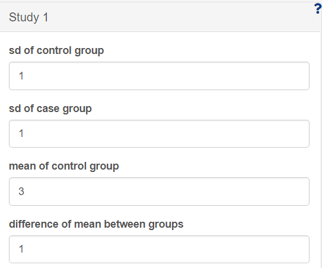
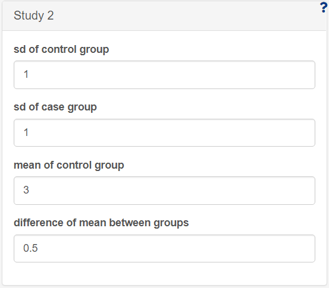
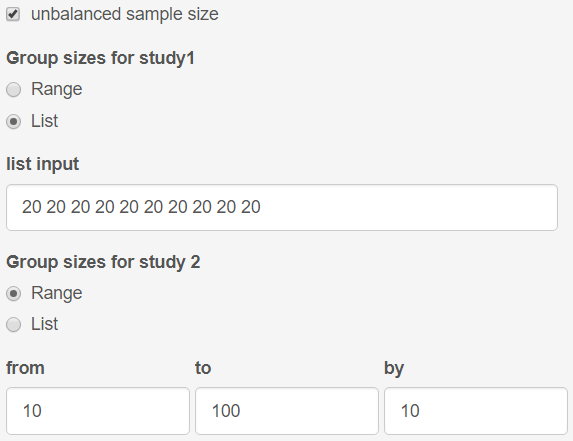
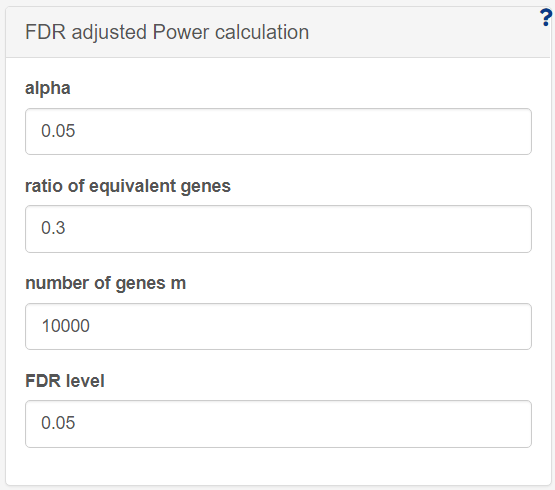
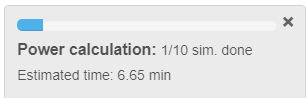
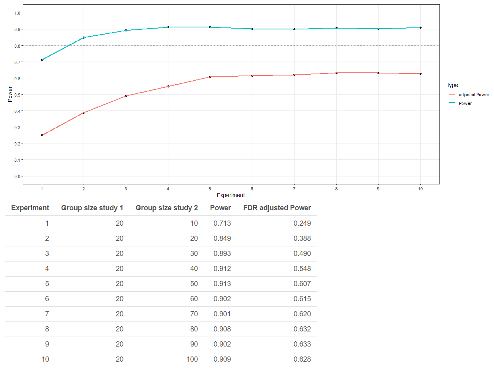

# Power calculations for ECI bootstrap test

For the purpose of identifying equivalently changed genes we use the ECI bootstrap test (cite). Here we present a user friendly approach to estimate the power for a given group size of the ECI bootstrap test.  For each simulated study the user can define for a gene:

* the standard deviation of gene expression values for the case group and the control group seperately
* the mean gene expression value for the control group in log scale
* the difference between the mean of the case group and the control group in log scale

The app is designed in a way that the group sizes are balanced in one study (control and case) but could be unbalanced between the two studies. The user can decide to calculate the power for only one group size (balanced or unbalanced) or for multiple group sizes where the power will be calculated pairwise for unbalanced group sizes. Hence, it is neccesary to give the same number of group sizes for both studies. The group sizes could be defined sequentially as range input, where the starting point of the list ("from"), the end point of the list ("to") and the step size for the increment in the list ("by") must be defined. The group size could also be defined in a list of group sizes seperated by space.

Finally, the user can define some miscellaneous values such as the number of iterations to calculate the power or the starting seed for reproducable results. 

In the following is demonstrated an example on how to use the app:

## Case study: unbalanced sample size with different mean differences in the two studies

Consider a case where a researcher has a study with a group size of 20 for each control and case group with 10,000 genes with non-zero expression status. Now they want to know at which group size of the second study he would gain a power greater than 80 %. Additionally, the difference in the mean of expression values for the control and treatment groups of the first study is 1 and he is interested what the effect would be when the mean difference for case and control of the second study would be lower, e.g. 0.5.

First the researcher has to define the basic characteristics for each study as shown in figure 1 and 2 below where the mean difference for study 1 is 1 and the mean difference for study 2 is 0.5.

Furthermore, the markbox for unbalanced data has to be ticked. When selecting "List" for "Group sizes for study 1" we can repeat the group size of 20 as often as we need.
For "Group sizes for study 1" we can keep the "Range" input and define a range from 10 to 100 in steps of 10.

Aditionally, the researcher has to set the number of genes he wants to calculate the power for to 10,000. He expects a large proportion of genes to be equivalent between the two studies so he does not change the default value of 0.3 for the ratio of equivalent genes. 

With all values defined we can click the "GO" button, which will start the power calculation. After finishing the calculation for the first group size the power bar shows the estimated time to finish the process.

Finally, after the calculation has finished we can see a line graph for the power and group sizes of the first study and a table with the values for power. As we can see, a power greater than 80 % is gained with a group size between of 70 for the second study.

